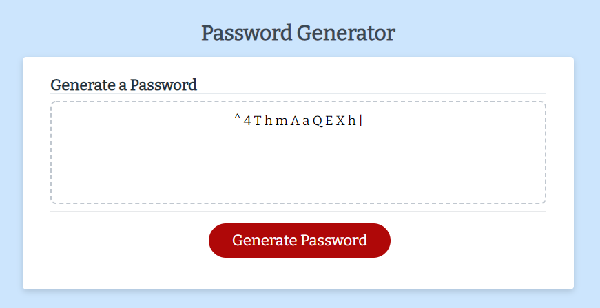

# Password Generator

The Password Generator lets you generate random passwords with numbers, upper or lowercase letters, and characters between 8 and 128 total characters.

## Installation

Click [to use the password generator](https://hrkoren.github.io/passwordgenerator/)

## Usage 

Follow the steps below to generate random passwords🔢 
1. Click on the [URL](https://hrkoren.github.io/passwordgenerator/) to open the site.
2. Click on the 'Generate Password' button.
3. When prompted enter the length of password desired. It must be between 8 and 128 total characters, then click 🆗
4. Click 🆗 if you want the password to contain numbers. Otherwise, click 'cancel.'
5. Click 🆗 if you want the password to contain special characters, such as "!, @, $, %", if not, click 'cancel.'
6. Click 🆗 to allow UPPERCASE letters. Click 'cancel' if you do not.
7. Click 🆗 if you want lowercase letters, and if not, click 'cancel.'
8. The password will then be generated and displayed in the box.
9. Click on the 'Generate Password' button again to create another random password based on the selections made, as noted above.

## Technologies Used
This project uses html, css, javascript, and Google Fonts.
## License

This project is not licensed.

## Tests

This generator can be tested by
1. Entering fewer than 8 or more than 128 characters.
2. Making different selections for each prompt to verify each selection is included or excluded from the generated password.

## Contact Information
[hrkoren@gmail.com](mailto:hrkoren@gmail.com)